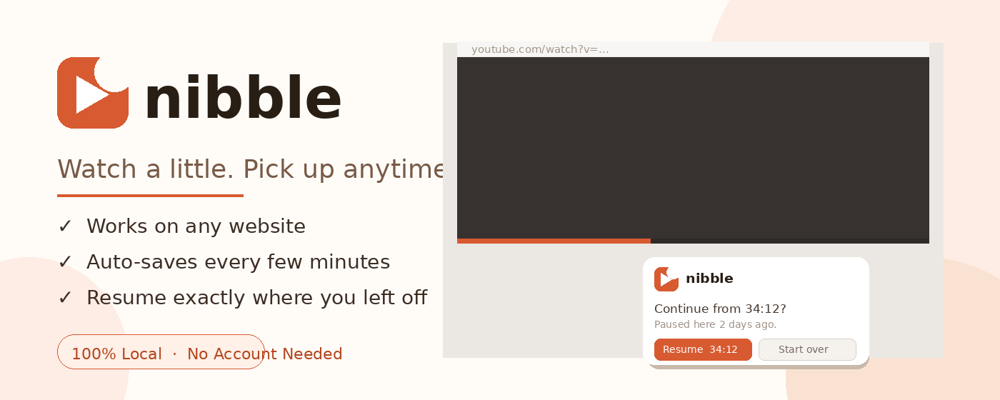
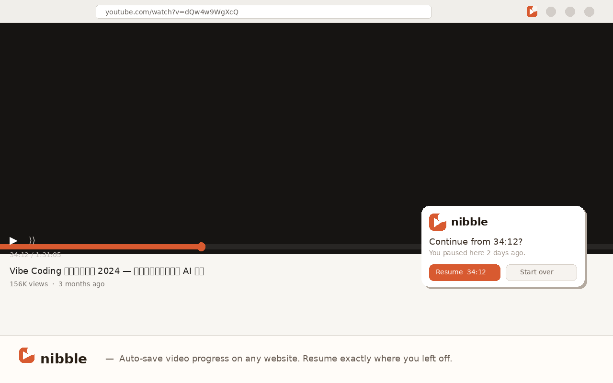

# 🎬 Nibble

> Watch a little. Pick up anytime.

Nibble is a Chrome extension that automatically saves your video progress on **any website** — YouTube, Netflix, Bilibili, X, and more. Next time you visit the same page, it asks if you'd like to resume right where you left off.

---

## ✨ Features

- **Works on any website** — not just YouTube. Any page with an HTML5 video player.
- **Auto-saves in the background** — every 1, 5, or 10 minutes (your choice). No buttons to click.
- **Saves on pause too** — progress is saved the moment you pause or close the tab.
- **Resume prompt** — a small toast appears when you return to a video page, asking if you'd like to continue.
- **Watch history dashboard** — see all your in-progress and completed videos in one place.
- **100% local** — all data is stored on your device via Chrome's built-in storage. Nothing is sent to any server.
- **No account required** — install and go.

---

## 📸 Screenshots

<p align="center">
  
  &nbsp;&nbsp;
  
</p>

---

## 🚀 Installation

### Chrome Web Store (recommended)

[**Install Nibble from the Chrome Web Store →**](https://chromewebstore.google.com/detail/nibble/dnjielhhidlnjoepcinmffkhdjgdnfjf)

### Load locally (for development)

1. Clone this repo
   ```bash
   git clone https://github.com/jianglilai608-cmyk/nibble.git
   ```
2. Open Chrome and go to `chrome://extensions`
3. Enable **Developer mode** (top right)
4. Click **Load unpacked** and select the `nibble` folder

---

## 🗂 Project Structure

```
nibble/
├── manifest.json        # Extension manifest (MV3)
├── background.js        # Service worker — alarms, storage
├── content.js           # Injected into every page — video detection, resume toast
├── popup/
│   ├── popup.html
│   ├── popup.css
│   └── popup.js         # Recent videos list, settings
├── dashboard/
│   ├── index.html
│   ├── style.css
│   └── app.js           # Full watch history, search, filter
└── icons/
    ├── icon16.png
    ├── icon32.png
    ├── icon48.png
    └── icon128.png
```

---

## 🔒 Privacy

Nibble stores only the following data **locally on your device**:

- Page URL
- Video timestamp (how far you watched)
- Page title
- Website hostname
- Actual watch time (seconds played)

No data ever leaves your browser. No analytics. No tracking.

---

## 📝 License

MIT — feel free to fork and build on top of this.

---

<p align="center">Made with ☕ and too many half-watched videos.</p>
